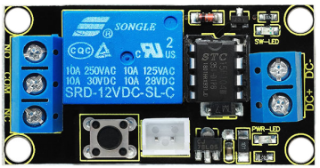
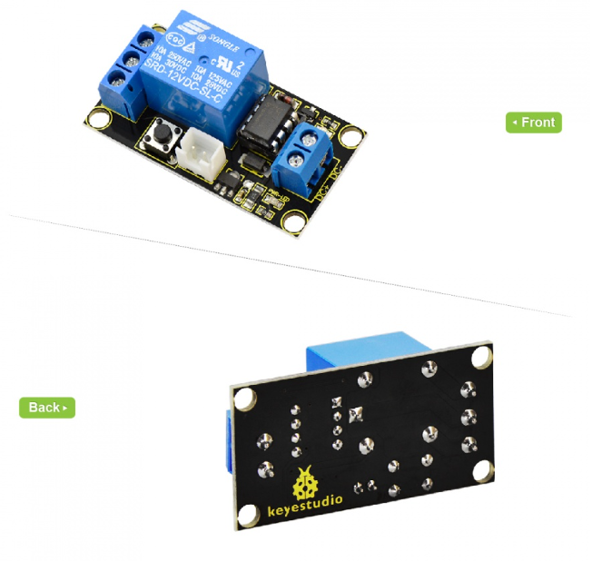
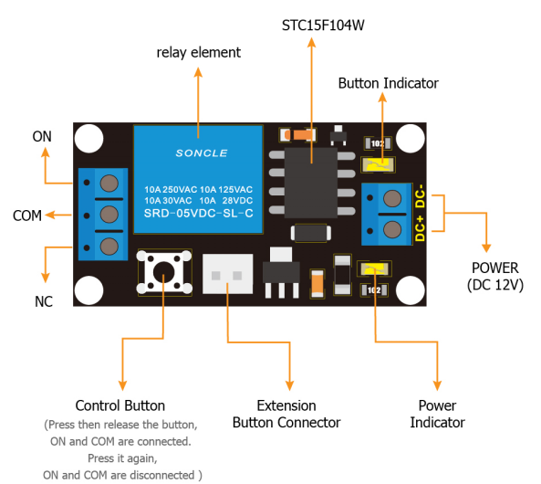
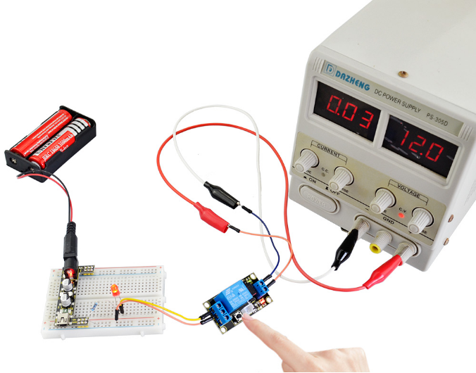

# KS0317 keyestudio Relay Module (Black and Environmental-friendly)

## 1. Overview

This is a button-controlled relay module. It integrates a 12V relay.  

Powered on, you can control the relay on and off through a tactile button on the module. Or you can connect up the white connector on the module to replace the tactile button, so as to remotely control the relay on and off.

## 2. Features

- Onboard comes with a 12V relay
- Control the relay via button or white connector
- With four fixed holes, you can mount it on other devices
- Safe and environmental-friendly

## 3. Parameters

- Operating voltage: DC 12V
- Operating current: 30mA

## 4. Example Use

Connect DC 12V voltage to DC+ and DC- terminal block on the relay, press down the button, relay is turned on, NO and COM terminals are connected, NC and COM terminals are disconnected.

Press the button again, NO and COM terminal will be disconnected, while NC and COM terminal are connected.

For example, we have supplied DC 12V to the relay module, press the button, relay is turned on, and NO and COM terminals are connected. Meanwhile, power an LED with a breadboard power module, you should see an LED connected on the breadboard lights up. As shown in the picture below.

